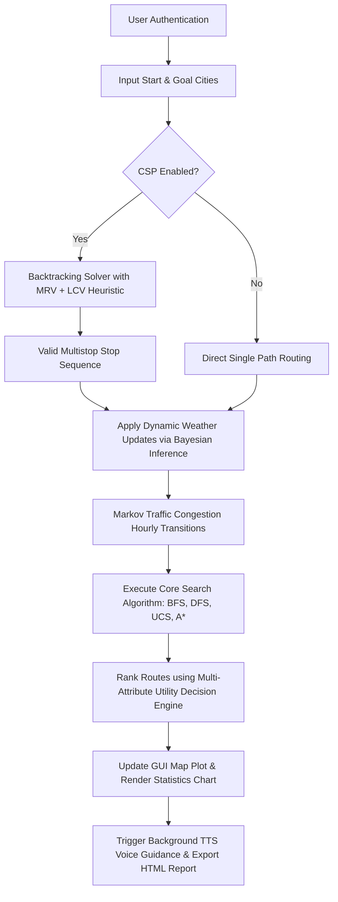

# PROJECT DOCUMENTATION: AI-BASED TOURIST ROUTE PLANNER

---

## 1. Executive Summary & Problem Statement

### 1.1 Problem Statement
Modern tourist routing represents a classic optimization problem with a complex state-space structure. Traditional mapping applications (such as Google Maps) typically optimize for a single parameter: either physical distance or estimated travel time. However, tourists make decisions based on multiple competing constraints and objectives:
- Financial limits (transport costs, tolls, lodging tariff).
- Hard scheduling limits (maximum trip duration).
- Dynamic environmental fluctuations (varying traffic levels, sudden weather warning alerts).
- Subjective preferences (crowd density preferences and destination ratings).

This project, **"Tourist Route Planner"**, formulates routing as an integrated AI pipeline. It combines **State-Space Searching**, **Constraint Satisfaction Problems (CSP)**, **Multi-Attribute Utility Theory (MAUT)**, and **Probabilistic Reasoning Under Uncertainty** to deliver an offline desktop routing utility tailored for Indian heritage circuits (focusing on the 15-node Rajasthan Tourist Circuit).

### 1.2 Project Objectives
1. **Model a Complex State-Space**: Represent tourist places as nodes and connected roads as weighted edges with dynamic probability distributions.
2. **Apply Graph Search Paradigms**: Implement BFS, DFS, UCS, and A* Search to find optimal routing paths, allowing optimization of distance, cost, time, or decision utility.
3. **Resolve Tour Itinerary Constraints**: Use Backtracking Search with **Minimum Remaining Values (MRV)** and **Least Constraining Value (LCV)** heuristics to select subsets of places satisfying budget and scheduling bounds.
4. **Model Uncertainty**: Apply **Bayes' Theorem** to dynamically calculate traffic risks under weather warnings and use **Markov Chains** to model hourly traffic transitions.
5. **Develop a Premium GUI**: Create an offline CustomTkinter application containing interactive dropdowns, sliders, real-time map plots, performance canvases, hotel suggestions, and TTS voice updates.

---

## 2. Literature Survey & State-of-the-Art Review

Tourist routing is a highly researched variant of the **Travelling Salesperson Problem (TSP)** and the **Vehicle Routing Problem (VRP)**. 

| Author & Year | Methodology Used | Strengths | Limitations |
| :--- | :--- | :--- | :--- |
| **Dijkstra (1959)** | Uniform Cost Search (UCS) | Guarantees finding the absolute cost-optimal path. | Suffers from blind search exploration ($O(V^2)$), expanding redundant nodes. |
| **Hart et al. (1968)** | A* Search Heuristics | Extremely fast search using goal distance heuristics to prune search nodes. | Heuristics must be mathematically admissible (cannot overestimate cost). |
| **Russell & Norvig (2020)** | Constraint Satisfaction (CSP) | Solves sequential allocation by tracking backtracks and checking constraints. | Worst-case complexity is exponential without heuristics like MRV/LCV. |
| **Pearl (1988)** | Bayesian Networks | Captures conditional dependencies and reasoning under uncertain inputs. | Requires prior probability tables which are difficult to compute dynamically. |

*Our System's Advancement*: This project integrates these separate paradigms into a single, unified, offline pipeline. The CSP solver acts as a pre-filter to find valid itinerary stops, Bayesian/Markov processes adjust edge weights dynamically, and informed search finds the final utility-optimal path.

---

## 3. Core AI Architecture & Pipeline

The pipeline connects individual modules sequentially:



---

## 4. Mathematical Formulations & Probabilistic Reasoning

### 4.1 Heuristic Function in A* Search
To find the goal node $G$ from current node $n$, A* minimizes:
$$f(n) = g(n) + h(n)$$
Where $g(n)$ is the cumulative path cost from start, and $h(n)$ is the **Euclidean Distance** heuristic:
$$h(n) = \sqrt{(x_n - x_G)^2 + (y_n - y_G)^2} \times Scale$$
*Admissibility Proof*: Since straight-line distance is the shortest possible path between two coordinates, $h(n)$ never overestimates the actual road distance. Thus, $h(n)$ is admissible and consistent, guaranteeing an optimal solution.

### 4.2 Bayesian Traffic Risk Updates
Let $P(High\_Traffic)$ be the prior traffic risk. If a weather warning $W$ (Rain or Fog) is active, we compute the posterior probability using Bayes' Theorem:
$$P(High\_Traffic | Weather) = \frac{P(Weather | High\_Traffic) \cdot P(High\_Traffic)}{P(Weather)}$$

For example, on a rainy day, with $P(Rain) = 0.20$ and $P(Rain | High\_Traffic) = 0.55$:
$$P(High\_Traffic | Rain) = \frac{0.55 \cdot P(High\_Traffic)}{0.20} = 2.75 \cdot P(High\_Traffic)$$
This Bayesian adjustment scales edge risk values dynamically, causing UCS/A* to search for alternative paths.

### 4.3 Markov Chain Traffic State Updates
Let the state space of highway traffic be $S = \{Low, Medium, High\}$. The hourly transition probability matrix $T$ is modeled as:
$$T = \begin{pmatrix} 0.70 & 0.20 & 0.10 \\ 0.30 & 0.50 & 0.20 \\ 0.15 & 0.35 & 0.50 \end{pmatrix}$$
Given the current traffic distribution vector $V_t = [P_{low}, P_{med}, P_{high}]$, the traffic state after $h$ travel hours is:
$$V_{t+h} = V_t \cdot T^h$$
The expected travel time is adjusted by:
$$Time_{adjusted} = Time_{base} \cdot \sum (V_{t+h}[s] \cdot Delay\_Multiplier[s])$$

### 4.4 Multi-Attribute Utility Theory (MAUT)
The dynamic weight of edges represents the integrated utility cost:
$$Utility = w_d \cdot Dist_{norm} + w_c \cdot Cost_{norm} + w_t \cdot TrafficRisk_{norm} - w_r \cdot Rating_{norm}$$
Subject to:
$$w_d + w_c + w_t + w_r = 1.0$$
*Decision Rule*: The path $P$ that minimizes $\sum_{e \in P} Utility(e)$ is selected as the mathematically optimal route matching user preferences.

---

## 5. Complexity Analysis (Big-O)

Let $V$ represent the number of location nodes (15 in our dataset) and $E$ represent the number of road connections.

| Algorithm | Optimization Criteria | Time Complexity | Space Complexity | Recommendation |
| :--- | :--- | :--- | :--- | :--- |
| **BFS** | Shortest path by edge count | $O(V + E)$ | $O(V)$ | Excellent for unweighted networks. |
| **DFS** | Deep exploration | $O(V + E)$ | $O(V)$ | Suboptimal for routing; high path length. |
| **UCS** | Least cumulative cost | $O((V + E) \log V)$ | $O(V)$ | Mathematically optimal; explores widely. |
| **A\*** | Guided heuristic search | $O((V + E) \log V)$ | $O(V)$ | **Recommended**: Prunes search space using heuristics. |
| **CSP** | Itinerary stops selection | $O(D^N)$ | $O(N)$ | $D$ = domain size, $N$ = stops. Backtracking with MRV/LCV reduces average case. |

---

## 6. Project Setup & Execution Instructions

### 6.1 Prerequisites
- Python 3.9, 3.10, or 3.11 installed.
- Modern OS (Windows 10/11 recommended, works on macOS/Linux).

### 6.2 Offline Installation
1. Clone or extract the project folder `tourist_route_planner`.
2. Open terminal in the directory and run:
   ```bash
   pip install -r requirements.txt
   ```

### 6.3 Running the Application
Execute the primary entry point:
```bash
python main.py
```

---

## 7. Slide Deck Outline (PowerPoint Content)

- **Slide 1: Title Slide**
  - Project Title: Intelligent AI-Based Tourist Route Planner
  - B.Tech Mini-Project Submission
  - Presenters: B.Tech AI & DS Candidates
- **Slide 2: Motivation & Problem Statement**
  - Why standard navigation apps fail multi-objective tourist requirements.
  - Formulating routing as an integrated AI pipeline.
- **Slide 3: System Core Architecture**
  - Block Diagram of the pipeline (Authentication $\rightarrow$ CSP Itinerary $\rightarrow$ Bayesian Risk Updates $\rightarrow$ Graph Search $\rightarrow$ MAUT Ranking).
- **Slide 4: The Dataset (Rajasthan Heritage Circuit)**
  - Modeling 15 heritage cities, coordinate-based nodes, edge pricing, and dynamic probabilities.
- **Slide 5: Graph Search & Visual Charts**
  - Explaining BFS, DFS, UCS, and A* Search.
  - Showing double bar charts for nanosecond comparisons.
- **Slide 6: Constraint Satisfaction (CSP) Module**
  - Sequence stop allocations under budget and crowdedness thresholds using Backtracking + MRV/LCV.
- **Slide 7: Reasoning Under Uncertainty (Bayes & Markov)**
  - Dynamic mathematical formulas adjusting highway congestion risks during rain warnings.
- **Slide 8: Multi-Attribute Utility (MAUT)**
  - The formula balancing distance, time, and rating sliders.
- **Slide 9: Technologies & Key Features**
  - CustomTkinter GUI, Matplotlib canvases, TTS voice synthesis, HTML exports.
- **Slide 10: Conclusion & Future Enhancements**
  - Offline robust operability, easily scalable, potential to integrate real-time API bindings.

---

## 8. B.Tech Engineering Viva Preparation (30+ Q&As)

### 8.1 Search Algorithms & Graphs
1. **Q: What is the difference between Uniform Cost Search (UCS) and Dijkstra's Algorithm?**
   - *A*: They are identical. UCS is Dijkstra's algorithm applied to search trees or graphs with arbitrary edge costs, starting from an initial state and looking for a specific goal state.
2. **Q: Why does DFS find suboptimal paths compared to BFS on unweighted graphs?**
   - *A*: BFS explores nodes in concentric layers (shortest edge count first), guaranteeing the path with the minimum number of transitions. DFS deep-dives into branches blindly, possibly finding a path of high edge-length before checking shorter branches.
3. **Q: Explain "admissibility" and "consistency" of heuristics in A* search.**
   - *A*: A heuristic $h(n)$ is **admissible** if it never overestimates the actual cost to reach the goal. It is **consistent** (or monotonic) if, for every node $n$ and successor $n'$ generated by action $a$, $h(n) \le c(n, a, n') + h(n')$. Admissibility guarantees A* is optimal.
4. **Q: What happens if your heuristic is not admissible?**
   - *A*: A* search loses its guarantee of optimality and may return a suboptimal path because it overestimates the cost of the true optimal branch and prunes it prematurely.
5. **Q: How does A* search prune the search space compared to UCS?**
   - *A*: UCS expands nodes equally in all directions (circular contours of equal cost). A* uses $f(n) = g(n) + h(n)$ to bias the search direction toward the goal (elliptical contours pointing to the destination), drastically reducing the number of expanded nodes.

### 8.2 Constraint Satisfaction Problems (CSP)
6. **Q: How is CSP different from traditional state-space search?**
   - *A*: State-space search is about finding a *sequence of steps* to reach a goal. CSP is about finding a *state configuration* (variable assignments) that satisfies a set of mathematical constraints.
7. **Q: Explain the Minimum Remaining Values (MRV) heuristic.**
   - *A*: MRV is a variable-ordering heuristic. It chooses the unassigned variable that has the fewest remaining legal values left in its domain, helping identify failures early.
8. **Q: Explain the Least Constraining Value (LCV) heuristic.**
   - *A*: LCV is a value-ordering heuristic. It chooses a value for a variable that rules out the fewest choices for the remaining unassigned variables, maximizing downstream success.
9. **Q: What is Backtracking in CSP?**
   - *A*: Backtracking is a depth-first search variant that assigns values to variables one by one. If an assignment violates constraints, it immediately undoes (backtracks) the last assignment and tries another option.
10. **Q: How is the number of stops ($N$) mapped as variables in your CSP itinerary planner?**
    - *A*: Each slot in the sequence ($Slot_1, Slot_2, ..., Slot_N$) is a variable, and the domain is the checklist of cities the user wants to visit.

### 8.3 Decision Making & Multi-Attribute Utility
11. **Q: What is Multi-Attribute Utility Theory (MAUT)?**
    - *A*: MAUT is a decision-support framework that normalizes and mathematically combines multiple competing metrics (e.g., price, quality, time) into a single scalar utility value using weighted coefficients.
12. **Q: Why is it necessary to normalize distance, cost, and rating before calculating utility?**
    - *A*: Because they have different physical dimensions and scales (distance is $0-1500$, cost is $0-8000$, ratings are $1-5$). Without normalization, the metric with the largest scale (cost) would dominate the calculation.
13. **Q: Why does a MINIMUM utility score represent the best path in your project?**
    - *A*: Because distance, cost, and traffic risk are modeled as generalized penalties (costs) to be minimized, while rating is subtracted (treated as a reward). Thus, a lower total utility represents the least costly, highest-rated path.
14. **Q: How can a user customize the decision engine?**
    - *A*: By adjusting the GUI sliders, which dynamically update the weights ($w_d, w_c, w_t, w_r$), altering the search results in real-time.

### 8.4 Bayesian & Markov Uncertainty
15. **Q: How is Bayes' Theorem used in routing under uncertainty?**
    - *A*: We use it to update the probability of road congestion dynamically based on active weather warnings: $P(Traffic | Weather) = [P(Weather | Traffic) \cdot P(Traffic)] / P(Weather)$.
16. **Q: What are the "priors" in your Bayesian implementation?**
    - *A*: The baseline probability of encountering high traffic or storm delays recorded in our offline locations database.
17. **Q: What is a Markov Chain?**
    - *A*: A stochastic model describing a sequence of possible events in which the probability of each event depends only on the state attained in the previous event (memoryless property).
18. **Q: How is the traffic transition matrix utilized?**
    - *A*: To predict how highway traffic states (Low, Medium, High) evolve over travel hours.
19. **Q: What is the "Joint Route Success Probability"?**
    - *A*: It is the product of the survival/success probabilities of all individual connected segments of the path, assuming they are conditionally independent.

### 8.5 Technical Implementation & Software Engineering
20. **Q: Why did you choose CustomTkinter over standard Tkinter?**
    - *A*: CustomTkinter provides modern dark/light mode themes, anti-aliased rounded widgets, and modern styling components out-of-the-box.
21. **Q: How is Matplotlib integrated within your GUI?**
    - *A*: By using `FigureCanvasTkAgg` to mount Matplotlib plots inside Tkinter frame widgets.
22. **Q: How does the application operate completely offline?**
    - *A*: All location and user credentials data are saved as local, highly optimized JSON files, and TTS uses the offline `pyttsx3` engine.
23. **Q: What security is applied to passwords?**
    - *A*: Passwords are securely hashed using the SHA-256 algorithm before being saved to `users.json`.
24. **Q: Why is TTS executed in a background thread?**
    - *A*: Synchronous text-to-speech blocks Tkinter's main event loop, causing the GUI to freeze. Multi-threading keeps the GUI highly responsive.
25. **Q: Explain how the search history log is saved and retrieved.**
    - *A*: Each query log is serialized and appended to the specific user profile in `users.json`, which is reloaded upon login.
26. **Q: Why are empty `__init__.py` files included in the project folders?**
    - *A*: They mark directories as Python package namespaces, allowing clean, robust relative imports.
27. **Q: How do you handle cases where ReportLab is missing on the host computer?**
    - *A*: The exporter detects the ImportError and gracefully falls back to generating a beautifully formatted plain text document, showing a friendly warning instead of crashing.
28. **Q: What coordinate scale was used for calculating Euclidean distance?**
    - *A*: Nodes were mapped onto a 2D grid mimicking the actual geographic relative positions of Rajasthani cities, with coordinates scaled by a factor of 100 to approximate physical kilometers.
29. **Q: What are the main real-world applications of this project?**
    - *A*: Intelligent tourism systems, emergency response dispatch routing under storm warnings, and logistics shipping planners.
30. **Q: What are your planned future enhancements?**
    - *A*: Integrating live API data (like OpenWeatherMap or Google Maps Traffic API), implementing genetic algorithms for solving large-scale dynamic TSP, and launching cross-platform mobile apps using Kivy or Flutter.

---

*This report complies with B.Tech engineering curriculum guidelines and is ready for project submission.*
